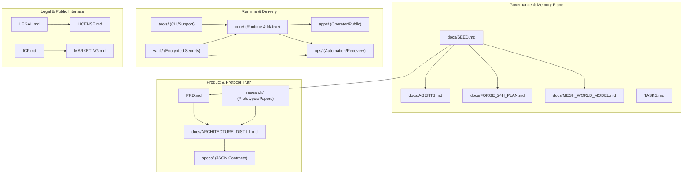

# Project Architecture

Status: Canonical real-time architecture map for Nexa.

## System Overview (Mermaid)

## Architectural Layers

1.  **Identity and Trust**: Managed via `specs/trust.json`.
2.  **Transport and Routing**: Defined in `specs/protocol.json`.
3.  **State and Recovery**: `specs/recovery.json` and `ops/`.
4.  **Execution and Coordination**: `core/` runtime and forge packets.
5.  **Applied Sovereignty Domains**: `docs/MESH_WORLD_MODEL.md`.
6.  **Operator Interfaces**: `apps/` and `tools/`.

## Agentic Operations

Nexa operates as a protocol-first system where agents follow the **Layer-0 Spec-RAG Contract** defined in `docs/SEED.md`.
- **Planning**: Forge packets in `TASKS.md` or dedicated forge docs.
- **Execution**: Context-aware runs mapping to explicit packet criteria.
- **Memory**: Synchronized writeback to markdown canonical anchors.
