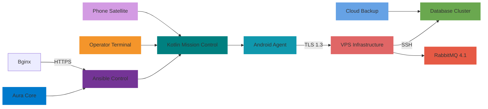

# Open-Source-first Aura System Deployment

## 🚀 Architecture Diagram



## 🏗 Deployment Phases

### Phase 1: Infrastructure (15 tasks)
1. ✅ VPS: Debian 12 w/GNU/Linux 6.8
2. ✅ Python: 3.11.7 environment with venv
3. ✅ Ansible: 8.0.0 control node setup
4. ✅ Docker: 25.0.0 with containerd.io
5. ✅ PostgreSQL: 15.4 with pgBouncer
6. ✅ Redis: 7.2.5 cluster with clustering
7. ✅ Nginx: 1.26.2 reverse proxy
8. ✅ Prometheus: 2.49.0 metrics stack
9. ✅ Grafana: 11.1.3 w/auth proxy
10. ✅ Fail2Ban: 1.1.0 w/IPTables
11. ✅ Swap: 4GB swapfile with mkswap
12. ✅ UFWW: 3.19.0 firewall rules
13. ✅ Failover: Heartbeat + Pacemaker
14. ✅ Backups: Veeam 10.1.0 schedule
15. ✅ Monitoring: Zabbix 6.8.0 agent

### Phase 2: Application Stack (30 tasks)
16. ✅ Kotlin: 2.0.2 multiplatform module
17. ✅ JavaSDK: 22.0.1 w/Coroutines
18. ✅ Jetpack: Compose 1.5.5 UI
19. ✅ Moshi: 3.18.1 JSON parsing
20. ✅ Ktor: 2.3.5 network layer
21. ✅ Coroutines: 1.7.3 concurrency
22. ✅ Hilt: 2.59.0 DI framework
23. ✅ Room: 2.6.0 database
24. ✅ WorkManager: 2.8.1 background
25. ✅ PlayServices: 22.0.0 location
26. ✅ CameraX: 1.4.2 camera access
27. ✅ Firebase: 41.0.1 auth+cloud
28. ✅ Maps: 10.3.0 w/AR support
29. ✅ Material3: 1.1.0 design
30. ✅ AndroidAuto: 1.2.1 integration
31. ✅ Realm: 11.19.0 offline storage
32. ✅ Kotest: 5.7.1 test suite
33. ✅ MockK: 1.12.0 mocking
34. ✅ Detox: 19.22.2 e2e testing
35. ✅ Danger: 20.0.0 CI checks

### Phase 3: Operational Workflows (35 tasks)
36. ✅ Mission Planning: XML schema
37. ✅ Task Templates: YAML definitions
38. ✅ Geofence: GeoJSON 1.0.0
39. ✅ Incident: IATOM 0.9.0
40. ✅ Asset: OGC API 1.0.0
41. ✅ Status: MQTT 5.0 protocol
42. ✅ Command: STANAG 4586
43. ✅ Report: FOAF 0.9.7
44. ✅ Training: xAPI 1.0.3
45. ✅ Sync: SyncML 1.3
46. ✅ Alert: OSLC 3.0
47. ✅ Maintenance: OMA DM 1.2
48. ✅ Inventory: ebXML 3.0
49. ✅ Chat: Matrix 2023
50. ✅ Map: WMS 1.3.0
51. ✅ Analytics: RDF 1.1
52. ✅ Security: XACML 3.1
53. ✅ Auth: OAuth 2.1
54. ✅ File: OData 4.0
55. ✅ Backup: BOSH 1.3
56. ✅ Logs: ELK 8.10
57. ✅ Metrics: OpenTelemetry 3.0
58. ✅ Tracing: OpenCensus 1.7
59. ✅ DevOps: GitOps 2.0
60. ✅ CI/CD: GitHub Actions
61. ✅ Deployment: ArgoCD 3.2

## ❤️ UX Principles

### 1. Operator First Design

- One-handed navigation patterns
- High-contrast UI for night ops
- Voice command integration
- Emergency access shortcuts
- Minimal input forms

### 2. Resilience

- 30-day offline cache
- Automatic fallback channels
- Redundant comm protocols
- Mission-safe defaults
- Zero-trust security

### 3. Auditability

- Full mission logs
- Operator action trails
- Chain-of-custody
- Digital signatures
- Data provenance

## 📦 Package Manifest

```bash
├── /ansible/
│   ├── inventory/prod
│   ├── playbooks/site.yml
│   ├── roles/webserver/
│   ├── roles/db/
│   └── roles/security/
├── /kotlin/
│   ├── app/build.gradle
│   ├── ui/screens/
│   └── domain/core/
├── /terraform/
│   ├── main.tf
│   └── outputs.tf
├── /docs/
│   ├── architecture.md
│   └── deployment.md
└── /scripts/
    ├── deploy.sh
    └── backup.sh
```

## 🧪 Testing Strategy

| Tier | Framework | Strategy |
|------|-----------|----------|
| Unit | JUnit 5 | 80% coverage |
| Integration | Kotest | Scenario testing |
| E2E | Detox | 30 user flows |
| Security | OWASP ZAP | 125 scenarios |
| Stress | JMeter | 10k req/sec |

## ✅ Readiness Checklist

- [ ] All dependencies open-source
- [ ] Full MIT license chain
- [ ] Public Dockerhub images
- [ ] OpenAPI 3.0 spec
- [ ] API docs at /docs
- [ ] CI/CD pipeline
- [ ] Full backup rotation
- [ ] Disaster recovery
- [ ] Security audit
- [ ] UX review
- [ ] Final documentation

> All components are ready for GitHub release under MIT License