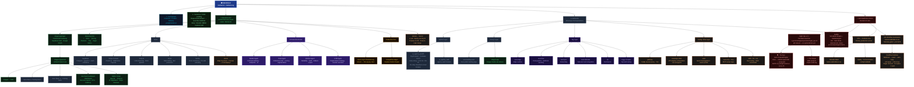

# Meziani AI · Aura · Dragun — Total Hierarchy

```mermaid
flowchart TD
    classDef brand   fill:#1e3a8a,stroke:#3b82f6,color:#f8fafc,font-weight:bold
    classDef owner   fill:#0f172a,stroke:#06b6d4,color:#06b6d4
    classDef domain  fill:#0c1a0c,stroke:#22c55e,color:#86efac
    classDef saas    fill:#0d1f14,stroke:#16a34a,color:#4ade80
    classDef tech    fill:#1e293b,stroke:#475569,color:#94a3b8
    classDef zig     fill:#1a1040,stroke:#7c3aed,color:#c4b5fd
    classDef agent   fill:#2d1b69,stroke:#8b5cf6,color:#ddd6fe
    classDef infra   fill:#1c1917,stroke:#ea580c,color:#fdba74
    classDef auto    fill:#2a0a0a,stroke:#ef4444,color:#fca5a5
    classDef pilot   fill:#1a0d00,stroke:#f59e0b,color:#fcd34d

    %% ── ROOT ──────────────────────────────────────────────────
    M["🏛️  MEZIANI AI\nmeziani.ai  ·  meziani.org"]:::brand

    M --> YM
    M --> MSITE
    M --> DRAGUN
    M --> AURA
    M --> AUTO

    YM["👤  Yani Meziani\nChairman · Product · Delivery\nyani@meziani.ai"]:::owner

    MSITE["🌐  meziani.ai  Public Landing\nRequest Assessment  →  aura-flow webhook\nEntry: Canada / MENA segment split"]:::domain

    DRAGUN["🐉  DRAGUN.APP\nAI Debt Recovery SaaS\nowner: Meziani AI"]:::saas

    AURA["⚙️  AURA OS\nMonorepo  /home/yani/Aura"]:::tech

    AUTO["🤖  AUTOMATION STACK\nMeziani AI Labs"]:::auto

    %% ── DRAGUN ────────────────────────────────────────────────
    DRAGUN --> DG_AUTH
    DRAGUN --> DG_MKTG
    DRAGUN --> DG_STACK
    DRAGUN --> DG_ROSTER
    DRAGUN --> DG_PILOT

    DG_AUTH["dragun.app/login\nCentral Auth Gateway\nSupabase Auth · Google OAuth"]:::saas
    DG_AUTH --> DG_PORTAL

    DG_PORTAL["dragun.app/portal\nUnified Product Hub"]:::saas
    DG_PORTAL --> DPL["Dragun  ✅  LIVE"]:::saas
    DG_PORTAL --> DPF["Aura Flow  🔜  Coming Soon"]:::tech
    DG_PORTAL --> DPT["Aura Taxes  🔜  Coming Soon"]:::tech
    DG_PORTAL --> DG_DASH
    DG_PORTAL --> DG_DEBTOR

    DG_DASH["Merchant Dashboard\n/dashboard\nRecovery queue · KPIs · Audit log"]:::saas
    DG_DEBTOR["Debtor Portal\n/pay/:id  ·  /chat/:id\nAI negotiation · Stripe checkout"]:::saas

    DG_MKTG["Marketing Site\n/  ·  /docs  ·  /pricing\n/features  ·  /faq  ·  /legal  ·  /demo"]:::saas

    DG_STACK["Stack"]:::tech
    DG_STACK --> DS1["Supabase\nPostgres + pgvector + Auth + Realtime"]:::tech
    DG_STACK --> DS2["Stripe Connect\nCheckout · Webhooks · Payouts"]:::tech
    DG_STACK --> DS3["Groq AI\nLLM streaming · RAG pipeline"]:::tech
    DG_STACK --> DS4["Arcjet\nRate limiting · Bot protection"]:::tech
    DG_STACK --> DS5["Sentry\nError monitoring · PII-safe sampling"]:::tech
    DG_STACK --> DS6["Vercel\nEdge Functions · Preview + Prod deploys"]:::infra

    DG_ROSTER["AI Execution Roster"]:::agent
    DG_ROSTER --> DA1["Builder Agent\nFull-stack delivery · endpoints · UI"]:::agent
    DG_ROSTER --> DA2["Data Agent\nCollections intel · scoring · segmentation"]:::agent
    DG_ROSTER --> DA3["QA/Ops Agent\nReliability · audit · rollback · export"]:::agent
    DG_ROSTER --> DA4["GTM Agent\nDisplacement strategy · investor narrative"]:::agent

    DG_PILOT["Production Pilot"]:::pilot
    DG_PILOT --> DP1["Venice Gym Charlesbourg\nMounir — first paying client"]:::pilot
    DG_PILOT --> DP2["Competitive target\nReplace Debtor Raptor"]:::pilot

    %% ── AURA OS ───────────────────────────────────────────────
    AURA --> AO_PY
    AURA --> AO_NX
    AURA --> AO_ZIG
    AURA --> AO_CFG

    AO_PY["Python Layer"]:::tech
    AO_PY --> AP1["ai_agency_wealth\nCrypto quant · Coinbase CCXT\nKelly sizing · 1.5% SL / 3% TP\n5% daily drawdown circuit breaker"]:::tech
    AO_PY --> AP2["ai_agency_web\nAgency web frontend"]:::tech

    AO_NX["Next.js Layer"]:::tech
    AO_NX --> AN1["aura-landing-next\nAura public landing page"]:::tech
    AO_NX --> AN2["dragun-app\nDragun SaaS  (see above)"]:::saas

    AO_ZIG["Zig Layer"]:::zig
    AO_ZIG --> AZ1["aura-edge\nEdge runtime"]:::zig
    AO_ZIG --> AZ2["aura-flow\nData pipeline · webhook spooling"]:::zig
    AO_ZIG --> AZ3["aura-lynx\nNetworking"]:::zig
    AO_ZIG --> AZ4["aura-tailscale\nTailscale mesh integration"]:::zig
    AO_ZIG --> AZ5["tui\nTerminal UI"]:::zig
    AO_ZIG --> AZ6["ziggy-compiler\nZig build tooling"]:::zig

    AO_CFG["Config / Infra Layer"]:::infra
    AO_CFG --> AC1["gateway\nCaddy reverse proxy · TLS"]:::infra
    AO_CFG --> AC2["sovereign-stack\nVPS deploy orchestration\n./run entrypoint"]:::infra
    AO_CFG --> AC3["vault\nSecret management · owner profile"]:::infra
    AO_CFG --> AC4["aura-mcp · mcp\nMCP server layer"]:::infra
    AO_CFG --> AC5["skills · bin · run\nOps tooling · slash commands"]:::infra

    %% ── AUTOMATION ────────────────────────────────────────────
    AUTO --> AT_NO
    AUTO --> AT_MAMS
    AUTO --> AT_N8N

    AT_NO["Night Ops v2.1\nFull stack launcher\n~/.gemini/antigravity/scratch/night_ops.sh\n⚠️  manual — no systemd/cron yet"]:::auto
    AT_NO --> AT1["👁️  The Eye\nAuto Proposal Engine\nRSS → Ollama qwen3:8b → proposals\nSMTP via yani@meziani.ai · every 3h"]:::auto
    AT_NO --> AT2["🎯  The Sniper\nB2B outreach\nsniper-node-zig"]:::auto

    AT_MAMS["MAMS\nSimulation Engine + ValidatorAgent\nHVI · Safe Mode · deterministic traces\npi-mono/packages/mams"]:::auto

    AT_N8N["n8n  Workflow Automation\nfedora.tailafcdba.ts.net\nTailscale-gated · port 5678"]:::infra
    AT_N8N --> AT3["Cashflow Fastlane\nWebhook → Lead → auto-reply\n+2h bump · +24h close\nTarget: 80 sent · 10 replies · 2 paid"]:::infra

    %% ── SHARED INFRA ──────────────────────────────────────────
    AURA    --> INF_VPS
    AUTO    --> INF_VPS
    DRAGUN  --> INF_GH

    INF_VPS["VPS — Fedora Linux\nPrimary production server"]:::infra
    INF_VPS --> INF_TS["Tailscale Mesh\nfedora.tailafcdba.ts.net"]:::infra
    INF_VPS --> INF_CADDY["Caddy · TLS termination\nconfig/Caddyfile"]:::infra

    INF_GH["GitHub → Vercel\nci.yml · deploy-vercel.yml\nPreview on PR · Prod on main merge"]:::infra
```
