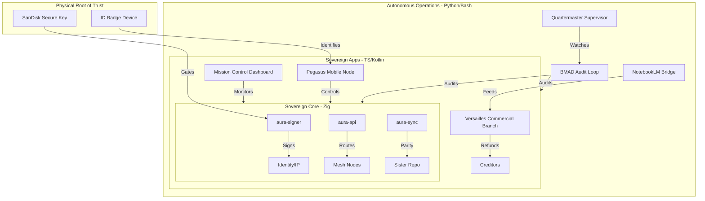

# Aura Codebase Architecture
Generated for the Sovereign Coding Community

```mermaid
graph TD
    subgraph Core [Sovereign Core - Zig]
        A[aura-signer] --> |Signs| B[Identity/IP]
        C[aura-api] --> |Routes| D[Mesh Nodes]
        E[aura-sync] --> |Parity| F[Sister Repo]
    end

    subgraph Apps [Sovereign Apps - TS/Kotlin]
        G[Mission Control Dashboard] --> |Monitors| Core
        H[Pegasus Mobile Node] --> |Controls| Core
        I[Versailles Commercial Branch] --> |Refunds| J[Creditors]
    end

    subgraph Ops [Autonomous Operations - Python/Bash]
        K[Quartermaster Supervisor] --> |Watches| L[BMAD Audit Loop]
        L --> |Audits| Core
        L --> |Audits| Apps
        M[NotebookLM Bridge] --> |Feeds| I
    end

    subgraph Hardware [Physical Root of Trust]
        N[SanDisk Secure Key] --> |Gates| A
        O[ID Badge Device] --> |Identifies| H
    end
```
