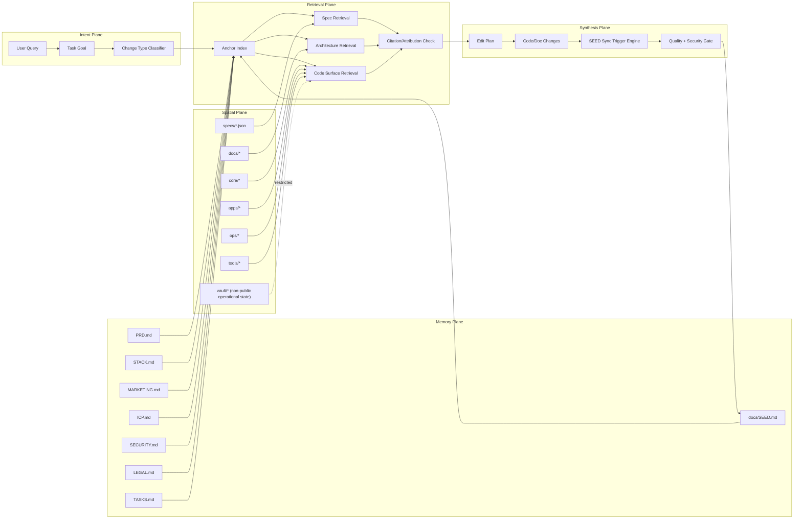

# ELECTRO_SPATIAL_RAG.md

Status: Canonical Electro Spatial RAG architecture memory for agent context.

## 1) Definition

Electro Spatial RAG is the repository's architecture-aware retrieval model:
- electro = active signal routing between intent, context, and evidence
- spatial = repository topology as first-class memory (docs, specs, code surfaces)
- rag = retrieval-first grounding before generation or edits

It provides a solid-state architecture distill that agents can repeatedly load with low ambiguity.

## 2) Core Objectives

- keep agent context synchronized with evolving architecture
- enforce source-grounded retrieval from canonical anchors
- make system state visible through Mermaid and text maps
- reduce drift between docs, specs, and implementation

## 3) Solid-State Distill (Mermaid)

## 4) Retrieval Priority Order

1. `docs/SEED.md` (global memory and synchronization policy)
2. `PRD.md` and system intent docs
3. security/legal anchors (`SECURITY.md`, `LEGAL.md`, `LICENSE`)
4. architecture and protocol docs in `docs/`
5. machine-readable contracts in `specs/`
6. code surfaces (`core/`, `apps/`, `ops/`, `tools/`)

## 5) Evolution Rules

Electro Spatial RAG must evolve with the codebase.

Update this file when:
- architecture boundaries change
- canonical anchors change
- retrieval order or trust constraints change
- new subsystem families are added or removed

In the same change set, also update:
- `docs/SEED.md`
- `docs/AGENTS.md`
- `TASKS.md` (if execution process changed)

## 6) Agent Context Contract

Before edits:
- classify change type (architecture, stack, security, legal, product, messaging, ICP, operations)
- load relevant anchors
- collect repository evidence

After edits:
- verify citations and attribution paths
- refresh Mermaid/text architecture memory when structure changed
- validate SEED synchronization rules

## 7) Anti-Drift Controls

- no architecture claims without repository path evidence
- no speculative subsystem ownership without docs/spec references
- no completion state when SEED sync is missing for triggered categories
