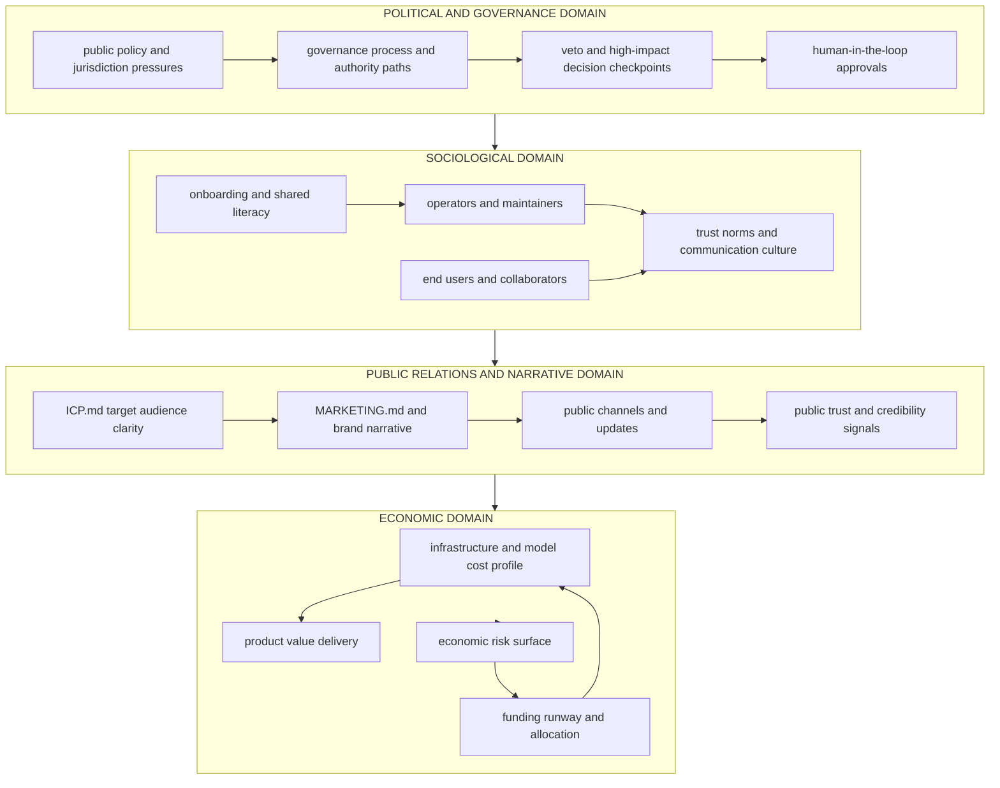

# GOVERNANCE_MODEL.md

Status: Canonical map for social, political, economic, and public relations domains.

```mermaid
flowchart TB
  subgraph SOCIAL["SOCIOLOGICAL DOMAIN"]
    OPERATORS["operators and maintainers"]
    USERS["end users and collaborators"]
    NORMS["trust norms and communication culture"]
    TRAINING["onboarding and shared literacy"]
    OPERATORS --> NORMS
    USERS --> NORMS
    TRAINING --> OPERATORS
  end

  subgraph POLITICAL["POLITICAL AND GOVERNANCE DOMAIN"]
    GOVERN["governance process and authority paths"]
    VETO["veto and high-impact decision checkpoints"]
    HITL["human-in-the-loop approvals"]
    POLICY["public policy and jurisdiction pressures"]
    GOVERN --> VETO
    VETO --> HITL
    POLICY --> GOVERN
  end

  subgraph ECON["ECONOMIC DOMAIN"]
    COST["infrastructure and model cost profile"]
    VALUE["product value delivery"]
    FUNDING["funding runway and allocation"]
    RISK["economic risk and dependency concentration"]
    COST --> VALUE
    FUNDING --> COST
    RISK --> FUNDING
  end

  subgraph PR["PUBLIC RELATIONS AND NARRATIVE DOMAIN"]
    BRAND["MARKETING.md and brand narrative"]
    ICP["ICP.md target audience clarity"]
    OUTREACH["public channels and updates"]
    TRUSTPUB["public trust and credibility signals"]
    BRAND --> OUTREACH
    ICP --> BRAND
    OUTREACH --> TRUSTPUB
  end

  POLITICAL --> SOCIAL
  SOCIAL --> PR
  PR --> ECON
  ECON --> RISK["economic risk surface"]
```
