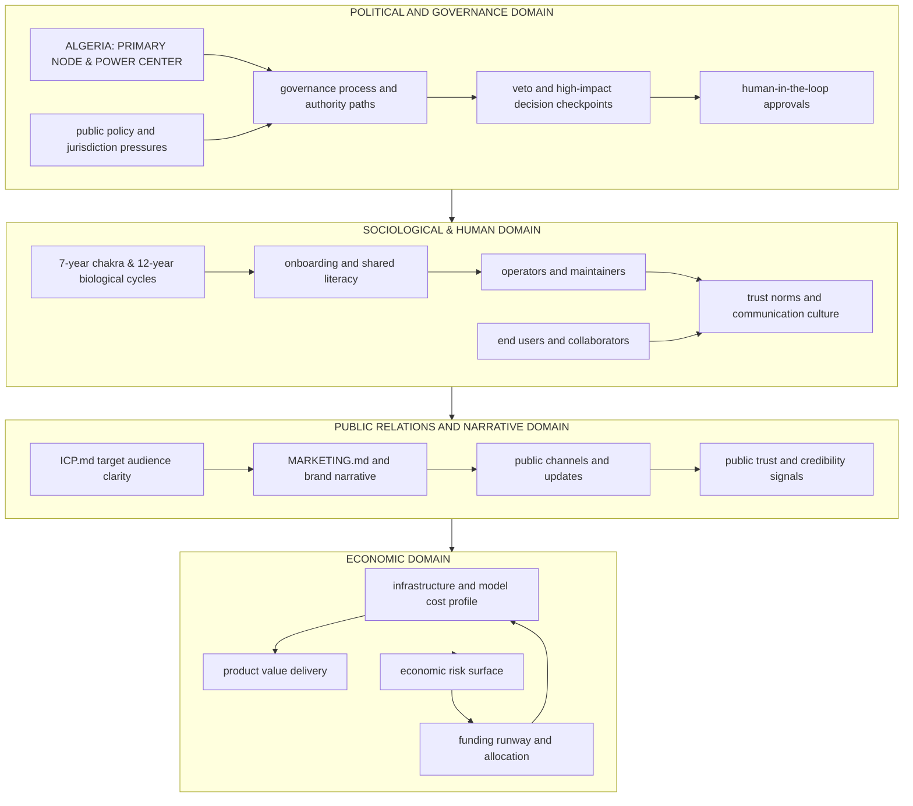

# GOVERNANCE_MODEL.md

Status: Canonical map for social, political, economic, and public relations domains.

## 2) Québec public-sector identity (REQ) and grid stewardship

Major **non-privatised** or **public-mandate** services in Québec are identified in machine-readable form in [`specs/quebec_req_public_identity.json`](../specs/quebec_req_public_identity.json). Each entry uses the **legal name** of the enterprise as the stable key; the **Numéro d’entreprise du Québec (NEQ)** must be taken only from an official lookup at the [**Registraire des entreprises du Québec**](https://www.registreentreprises.gouv.qc.ca/) under HITL, then written into that spec (never invented).

**Intent:** the legal person (crown corporation, public transit corporation, etc.) **owns the mandate, the work, and the accountable team** for protecting its operational grid. Private firms may implement under contract, but governance and vital locks default to **attributed biological operators** acting within that public legal person’s chain of authority—not anonymous outsourcing.

[`vault/org-registry.json`](../vault/org-registry.json) points at this spec. Partner grids in [`specs/grid_vital_lock.json`](../specs/grid_vital_lock.json) may reference `req_public_identity_ref` to align mesh slices with the REQ-backed identity record.
