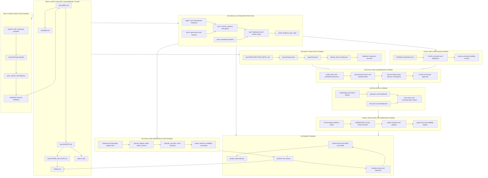

# MESH_WORLD_MODEL.md

Status: Single exhaustive mermaid map for project architecture, governance, and external reality domains.

```mermaid
flowchart TB
  subgraph L0["NEXA LAYER-0 SECURITY AND MEMORY PLANE"]
    SEED["docs/SEED.md"]
    AGENTS["docs/AGENTS.md"]
    PLAN24["docs/FORGE_24H_PLAN.md"]
    LICENSEH["LICENSE.md"]
    TASKS["TASKS.md"]
    SPECS["specs/*.json"]
    SEED --> AGENTS
    AGENTS --> PLAN24
    PLAN24 --> TASKS
    AGENTS --> SPECS
    SEED --> LICENSEH
  end

  subgraph TECH["TECHNICAL SYSTEM ARCHITECTURE"]
    APPS["apps/* user and operator interfaces"]
    CORE["core/* runtime, protocol, and agents"]
    OPS["ops/* deployment and control scripts"]
    TOOLS["tools/* operational helpers"]
    VAULT["vault/* evidence, logs, state"]
    DOCS["docs/* governance and memory"]
    APPS --> CORE
    CORE --> OPS
    OPS --> VAULT
    DOCS --> CORE
    TOOLS --> OPS
  end

  subgraph LEGAL["LEGAL AND COMPLIANCE DOMAIN"]
    LICENSETXT["LICENSE authoritative text"]
    LEGALMD["LEGAL.md policy and obligations"]
    DATA["privacy and data handling controls"]
    LICENSETXT --> LEGALMD
    LEGALMD --> DATA
  end

  subgraph PHYSICAL["PHYSICAL AND INFRASTRUCTURE DOMAIN"]
    DEVICES["phones, laptops, edge nodes, servers"]
    NETWORK["tailscale, vps links, mesh transport"]
    POWER["power, thermal, availability constraints"]
    SUPPLY["hardware and package supply chain"]
    DEVICES --> NETWORK
    NETWORK --> POWER
    SUPPLY --> DEVICES
  end

  subgraph SOCIAL["SOCIOLOGICAL DOMAIN"]
    OPERATORS["operators and maintainers"]
    USERS["end users and collaborators"]
    NORMS["trust norms and communication culture"]
    TRAINING["onboarding and shared literacy"]
    OPERATORS --> NORMS
    USERS --> NORMS
    TRAINING --> OPERATORS
  end

  subgraph POLITICAL["POLITICAL AND GOVERNANCE DOMAIN"]
    GOVERN["governance process and authority paths"]
    VETO["veto and high-impact decision checkpoints"]
    HITL["human-in-the-loop approvals"]
    POLICY["public policy and jurisdiction pressures"]
    GOVERN --> VETO
    VETO --> HITL
    POLICY --> GOVERN
  end

  subgraph ECON["ECONOMIC DOMAIN"]
    COST["infrastructure and model cost profile"]
    VALUE["product value delivery"]
    FUNDING["funding runway and allocation"]
    RISK["economic risk and dependency concentration"]
    COST --> VALUE
    FUNDING --> COST
    RISK --> FUNDING
  end

  subgraph PR["PUBLIC RELATIONS AND NARRATIVE DOMAIN"]
    BRAND["MARKETING.md and brand narrative"]
    ICP["ICP.md target audience clarity"]
    OUTREACH["public channels and updates"]
    TRUSTPUB["public trust and credibility signals"]
    BRAND --> OUTREACH
    ICP --> BRAND
    OUTREACH --> TRUSTPUB
  end

  subgraph SECURITY["SECURITY AND TRUST DOMAIN"]
    DISTILL["docs/ARCHITECTURE_DISTILL.md"]
    SPECSP["specs/protocol.json"]
    SPECST["specs/trust.json"]
    KEYS["identity, auth, key lifecycle"]
    INCIDENT["detection, response, recovery"]
    DISTILL --> SPECSP
    SPECSP --> SPECST
    SPECST --> KEYS
    KEYS --> INCIDENT
  end

  subgraph EXEC["MULTI-AGENT EXECUTION DOMAIN"]
    PROVIDERS["Gemini, OSS, and future providers"]
    PACKETS["versioned forge packets"]
    VERIFY["tests, checks, and evidence"]
    WRITEBACK["markdown memory writeback"]
    PROVIDERS --> PACKETS
    PACKETS --> VERIFY
    VERIFY --> WRITEBACK
    WRITEBACK --> SEED
  end

  L0 --> TECH
  L0 --> SECURITY
  L0 --> EXEC
  TECH --> PHYSICAL
  TECH --> LEGAL
  TECH --> ECON
  SECURITY --> POLITICAL
  POLITICAL --> SOCIAL
  SOCIAL --> PR
  PR --> ECON
  LEGAL --> POLITICAL
  PHYSICAL --> RISK["systemic risk surface"]
  ECON --> RISK
  RISK --> TASKS
```
