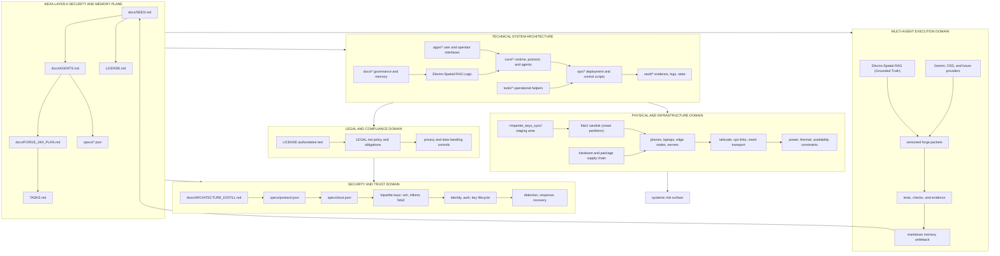

# MESH_WORLD_MODEL.md

Status: Technical mermaid map for project architecture, infrastructure, and execution.

```mermaid
flowchart TB
  subgraph L0["NEXA LAYER-0 SECURITY AND MEMORY PLANE"]
    SEED["docs/SEED.md"]
    AGENTS["docs/AGENTS.md"]
    PLAN24["docs/FORGE_24H_PLAN.md"]
    LICENSEH["LICENSE.md"]
    TASKS["TASKS.md"]
    SPECS["specs/*.json"]
    SEED --> AGENTS
    AGENTS --> PLAN24
    PLAN24 --> TASKS
    AGENTS --> SPECS
    SEED --> LICENSEH
  end

  subgraph TECH["TECHNICAL SYSTEM ARCHITECTURE"]
    APPS["apps/* user and operator interfaces"]
    CORE["core/* runtime, protocol, and agents"]
    OPS["ops/* deployment and control scripts"]
    TOOLS["tools/* operational helpers"]
    VAULT["vault/* evidence, logs, state"]
    DOCS["docs/* governance and memory"]
    ESRAGC["Electro-Spatial RAG Logic"]
    APPS --> CORE
    CORE --> OPS
    OPS --> VAULT
    DOCS --> ESRAGC
    ESRAGC --> CORE
    TOOLS --> OPS
  end

  subgraph LEGAL["LEGAL AND COMPLIANCE DOMAIN"]
    LICENSETXT["LICENSE authoritative text"]
    LEGALMD["LEGAL.md policy and obligations"]
    DATA["privacy and data handling controls"]
    LICENSETXT --> LEGALMD
    LEGALMD --> DATA
  end

  subgraph PHYSICAL["PHYSICAL AND INFRASTRUCTURE DOMAIN"]
    DEVICES["phones, laptops, edge nodes, servers"]
    SANDISK["fido2 sandisk (smart partitions)"]
    STAGING["~/tripartite_keys_sync/ staging area"]
    NETWORK["tailscale, vps links, mesh transport"]
    POWER["power, thermal, availability constraints"]
    SUPPLY["hardware and package supply chain"]
    DEVICES --> NETWORK
    SANDISK --> DEVICES
    STAGING --> SANDISK
    NETWORK --> POWER
    SUPPLY --> DEVICES
  end

  subgraph SECURITY["SECURITY AND TRUST DOMAIN"]
    DISTILL["docs/ARCHITECTURE_DISTILL.md"]
    SPECSP["specs/protocol.json"]
    SPECST["specs/trust.json"]
    TRIPARTITE["tripartite keys: ssh, mlkem, fido2"]
    KEYS["identity, auth, key lifecycle"]
    INCIDENT["detection, response, recovery"]
    DISTILL --> SPECSP
    SPECSP --> SPECST
    SPECST --> TRIPARTITE
    TRIPARTITE --> KEYS
    KEYS --> INCIDENT
  end

  subgraph EXEC["MULTI-AGENT EXECUTION DOMAIN"]
    PROVIDERS["Gemini, OSS, and future providers"]
    PACKETS["versioned forge packets"]
    ESRAG["Electro-Spatial RAG (Grounded Truth)"]
    VERIFY["tests, checks, and evidence"]
    WRITEBACK["markdown memory writeback"]
    PROVIDERS --> PACKETS
    ESRAG --> PACKETS
    PACKETS --> VERIFY
    VERIFY --> WRITEBACK
    WRITEBACK --> SEED
  end

  L0 --> TECH
  L0 --> SECURITY
  L0 --> EXEC
  TECH --> PHYSICAL
  TECH --> LEGAL
  PHYSICAL --> RISK["systemic risk surface"]
  LEGAL --> SECURITY
```
