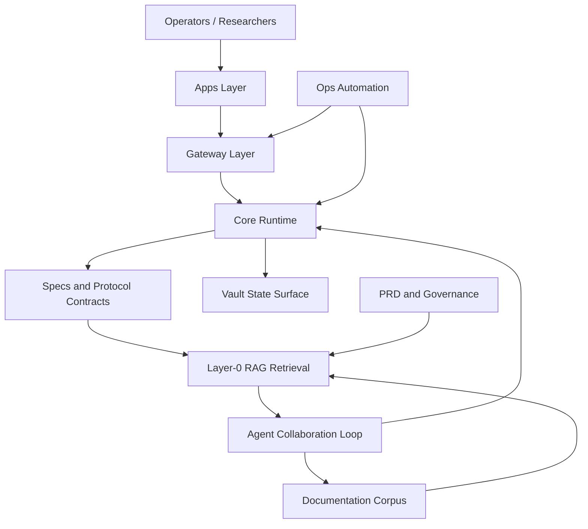

# SEED.md

Status: Canonical Layer-0 Seed for agentic exploration, RAG bootstrapping, and system truth synchronization.

## 1) Mission

Nexa is structured as a neurodiverse programmer and researcher friendly system:
- low-friction navigation
- explicit architecture memory
- deterministic source-of-truth files
- collaboration-ready agent protocols

SEED is the umbrella memory over:
- `PRD.md`
- `STACK.md`
- `MARKETING.md`
- `ICP.md`
- `SECURITY.md`
- `LEGAL.md`

This file must evolve with the codebase and stay synchronized with all six documents above.

## 2) Layer-0 Agentic RAG Contract

Layer-0 RAG in this repository means:
- retrieval begins from canonical docs and specs before ad hoc interpretation
- architecture memory is always available in both ASCII and Mermaid form
- edits to key files must trigger seed refresh tasks
- agent outputs must cite repository paths and upstream OSS sources when relevant
- Electro Spatial RAG topology is defined in `docs/ELECTRO_SPATIAL_RAG.md`

Primary retrieval anchors:
- `README.md`
- `PRD.md`
- `STACK.md`
- `MARKETING.md`
- `ICP.md`
- `SECURITY.md`
- `LEGAL.md`
- `docs/ELECTRO_SPATIAL_RAG.md`
- `docs/ARCHITECTURE.md`
- `docs/PROTOCOL.md`
- `docs/TRUST_MODEL.md`
- `docs/THREAT_MODEL.md`
- `specs/protocol.json`
- `specs/trust.json`
- `specs/recovery.json`
- `LICENSE`

## 3) ASCII Visual Memory (Architecture Snapshot)

```text
NEXA
|
+-- Apps Layer
|   +-- apps/aura-dashboard      (operator UI)
|   +-- apps/aura-landing-next   (landing + intake)
|   +-- apps/web                 (web workspace/components)
|
+-- Core Runtime Layer
|   +-- core/cerberus            (agent/runtime engine, zig)
|   +-- core/aura-api            (native API services)
|   +-- core/nexa-gateway        (gateway/runtime components)
|   +-- core/tui                 (terminal UI components)
|
+-- Ops and Deployment Layer
|   +-- ops/gateway              (fastapi gateway)
|   +-- ops/scripts              (automation/deploy scripts)
|   +-- ops/sovereign-stack      (deployment stack)
|
+-- Knowledge and Spec Layer
|   +-- docs/                    (governance, architecture, runbooks)
|   +-- specs/                   (machine-readable protocol/trust/recovery)
|   +-- research/                (research notes and references)
|
+-- Tooling and Interfaces
|   +-- tools/                   (cli/helpers)
|   +-- nexa / nexa.py           (entrypoint CLIs)
|
+-- State and Vault Surface
    +-- vault/                   (operator state, logs, generated artifacts)
```

## 4) Mermaid System Map



## 5) Stack Baseline

- Runtime: Zig, Python, Bash, Node.js
- Web/UI: Next.js, React, TypeScript
- Gateway/API: FastAPI (Python)
- Validation/Contracts: JSON specs, schema-driven checks, typed interfaces
- Security posture: trust boundaries, HITL gates, explicit policy docs
- License baseline: MIT (`LICENSE`)
- Canonical stack registry: `STACK.md`

## 6) Go-To-Market and User Fit Baseline

- Canonical marketing narrative: `MARKETING.md`
- Canonical ideal collaborator profile: `ICP.md`
- These files are required memory anchors for planning and roadmap decisions.

## 7) Change-Trigger Protocol (Mandatory)

Any meaningful repository edit triggers a SEED sync pass.

Trigger matrix:
- Product requirements changed -> update `PRD.md` and refresh SEED sections 1, 2, 5, 6
- Architecture or service boundaries changed -> update ASCII + Mermaid sections
- Runtime/tooling stack changed -> update `STACK.md` and Stack Baseline section
- Messaging/distribution changed -> update `MARKETING.md` and section 6
- Target audience/fit changed -> update `ICP.md` and section 6
- Work planning changed -> update `TASKS.md` and reflect status in SEED section 7
- Security policy changed -> update `SECURITY.md` and SEED section 8
- Licensing/legal attribution changed -> update `LICENSE`, `LEGAL.md`, and SEED section 8
- Transfer/compliance changes -> update `docs/transfer/*` and note in SEED section 9
- Electro Spatial RAG architecture changes -> update `docs/ELECTRO_SPATIAL_RAG.md` and this SEED file

## 8) Security, Legal, and OSS Source Rule

- Security policy source: `SECURITY.md`
- Legal policy source: `LEGAL.md`
- License of this repository: MIT (`LICENSE`)
- External OSS influences must be recorded in:
  - `docs/transfer/OSS_SOURCE_REGISTER.md`
- Agents must avoid undocumented borrowing; attribution is required.

## 9) Task Synchronization Link

`TASKS.md` is the short-horizon execution board.
SEED stores high-level memory and architecture invariants.
If task scope changes architecture, update both files in the same change set.

## 10) Neurodiverse-Friendly Authoring Rules

- Prefer short sections, explicit headings, and plain language.
- Keep architecture diagrams mirrored in text and graph form.
- Avoid hidden assumptions and unstated context jumps.
- Use stable file names for anchor docs to improve retrieval memory.

## 11) Seed Maintenance Ritual

On each significant merge or architecture edit:
1. refresh ASCII memory tree
2. refresh Mermaid map
3. verify anchors and stack section
4. cross-check `PRD.md`, `STACK.md`, `MARKETING.md`, `ICP.md`, `SECURITY.md`, `LEGAL.md`, `TASKS.md`, `LICENSE`
5. confirm no stale references
